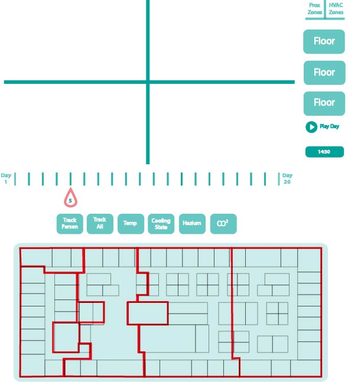
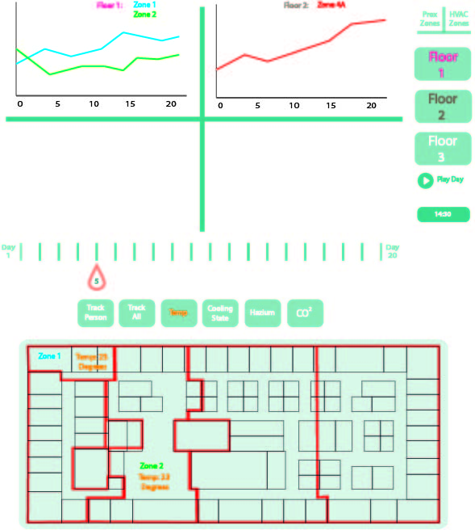

# Design document

## Loading in UI

Each different button will have his own vector ID, so we can select each id in D3, so when its clicked on we can add interactivity using the on_click function.
The whole layout of the page will be loaded in D3 as an SVG image, with all functional elements in a different layer, customly named so that the ID's can be selected and on_click functionality can be administered.

## Advanced Sketch 

In Figure 1 a picture of the UI is shown where each button will change the map underneath and adds a line-graph in one of the four empty spaces. For example if someone clicks on the Temp button, all area's in the map where heat sensors give output on that specific day and time will be colored within a heat spectrum with the value of that time in it's mid. And an empty space in the plus sign above will be filled with a line graph of the temperature given over a period of 20 days (see figure 2). 

Here a UI is shown where the button is clicked for both floor 1 and 2. So two line graphs are depicted in the plus sign with all available sensors as a seperate line. This way one can easily compare between different floors, substances etc. As for example the third graph could be of CO2. Because floor 1 was selected first a map is shown underneath with all the information regarding the chosen sensory button.

## Possible problems

* Since people aren't fully reliable with their prox-cards, there could be a gap in the information or an anomaly resulting from this. 
* Substance levels could be higher than expected, or lower indicating a faulty sensor.
* 

## TODO's

* Figuring out a way to quickly load and store data
* Getting the vector based buttons ready for functionality
* 

## List of API's

* Javascript D3
* SQL-Database

## DataSources

Our data is supplied by the 2016 VAST Challenge.

