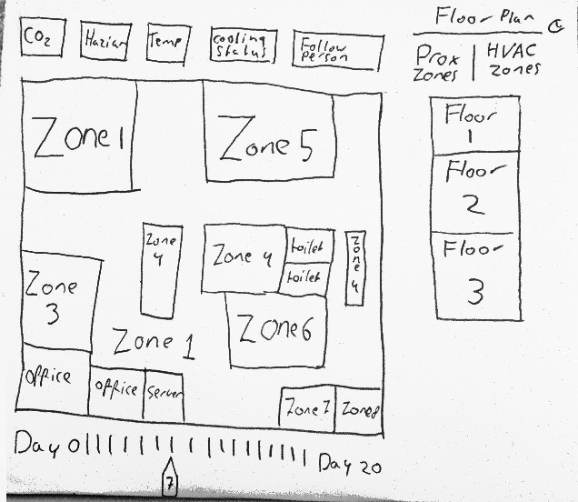
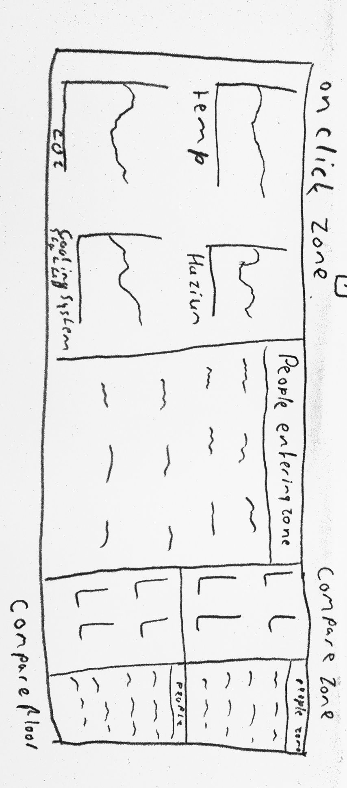

# Programmeer project

## The case

Gosia's warriors

From the Visual Analytics Community i will tend to the 2016 VAST Challenge: Mini Challenge 2.

This challenge envelops certain problems that arise when building a new building of a large company. This company is called GAStech, and their new building is build to the highest energy efficiency standard. So heating, ventilation and airconditioning zones (HVAC in short) are all monitored by sensors with respect to building temperatures, heating and cooling system status values and concentration of CO2 and hazium. Hazium is possibly dangerous to humans and will be monitored by just a small amount of sensors in different rooms.

Furthermore there are security issues which is why staff members, aswell as the robotic mail delivery system wear proximity cards that records the flow of their movement inside the building as they move from room to room. 

Here we have certain information sources to our disposal to analyse over a period of two weeks:

* A building layout for the GAStech offices, including the maps of the prox zones and the HVAC zones
* A current list of employees, roles, and office assignments
* A description of the data formats and fields provided
* Proximity sensor data for each of the prox zone regions
* Proximity sensor data from Rosie the mobile robot
* HVAC sensor readings and status information from each of the building’s HVAC zones
* Hazium readings from four sensors

And with these sources of information we will answer the following questions:

* What are the typical patterns in the prox card data? What does a typical day look like for GAStech employees?
* Describe up to ten of the most interesting patterns that appear in the building data. Describe what is notable about the pattern and explain its possible significance.
* Describe up to ten notable anomalies or unusual events you see in the data. Prioritize those issues that are likely to be the most likely to represent a danger or a serious issue for building operations.
* Describe up to five observed relationships between the proximity card data and building data elements. If you find a causal relationship (for example, a building event or condition leading to personnel behavior changes or personnel activity leading to building operations changes), describe your discovered cause and effect, the evidence you found to support it, and your level of confidence in your assessment of the relationship.

These questions will be answered by visualizing the data using the javascript D3 library to find certain trends. This visualisation will be very extensive as much information is given.

- An overview sketch of what the application will look like for the user; if you envision the application to have multiple screens, sketch these all out
- how you will get the data into the right form for your app
- What separate parts of the application can be defined (decomposing the problem) and how these should work together
- What external components (APIs) you need to make certain features possible
- Technical problems or limitations that could arise during development and what possibilities you have to overcome these
- A review of similar applications or visualizations in terms of features and technical aspects (what do they offer? how have they implemented it?)