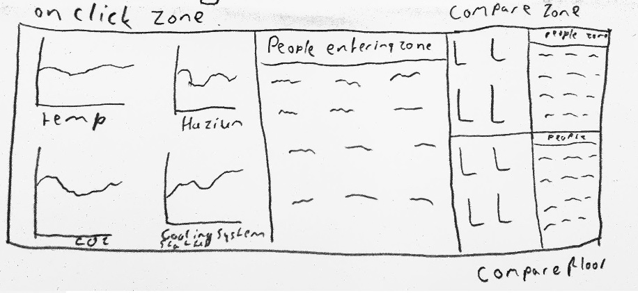

# Programmeer project

## The case

Gosia's warriors

From the Visual Analytics Community i will tend to the 2016 VAST Challenge: Mini Challenge 2.

This challenge envelops certain problems that arise when building a new building of a large company. This company is called GAStech, and their new building is build to the highest energy efficiency standard. So heating, ventilation and airconditioning zones (HVAC in short) are all monitored by sensors with respect to building temperatures, heating and cooling system status values and concentration of CO2 and hazium. Hazium is possibly dangerous to humans and will be monitored by just a small amount of sensors in different rooms.

Furthermore there are security issues which is why staff members, aswell as the robotic mail delivery system wear proximity cards that records the flow of their movement inside the building as they move from room to room. 

Here we have certain information sources to our disposal to analyse over a period of two weeks:

* A building layout for the GAStech offices, including the maps of the prox zones and the HVAC zones
* A current list of employees, roles, and office assignments
* A description of the data formats and fields provided
* Proximity sensor data for each of the prox zone regions
* Proximity sensor data from Rosie the mobile robot
* HVAC sensor readings and status information from each of the building’s HVAC zones
* Hazium readings from four sensors

And with these sources of information we will answer the following questions:

* What are the typical patterns in the prox card data? What does a typical day look like for GAStech employees?
* Describe up to ten of the most interesting patterns that appear in the building data. Describe what is notable about the pattern and explain its possible significance.
* Describe up to ten notable anomalies or unusual events you see in the data. Prioritize those issues that are likely to be the most likely to represent a danger or a serious issue for building operations.
* Describe up to five observed relationships between the proximity card data and building data elements. If you find a causal relationship (for example, a building event or condition leading to personnel behavior changes or personnel activity leading to building operations changes), describe your discovered cause and effect, the evidence you found to support it, and your level of confidence in your assessment of the relationship.

These questions will be answered by visualizing the data using the javascript D3 library to find certain trends. This visualisation will be very extensive as much information is given.

First we have a main visualisation of the floor plan with prox zones or HVAC zones. Each kind of zone can be selected in the top right corner, with floor selection underneath. Above the map you can select the kind of sensor you want to see data from, and data inside each zone will change accordingly, both in color and values inside the box. At the right of the kinds of sensor you can select a specific person you want to follow via a dropdown menu in which you can also write the name of the person you want to find, and it will autofinish the name for you to improve user friendliness. Inside the map a dot will then appear with a timestamp above it, and move the same way the person did that day. Underneath the map you can select the specific day you want to see all the data from. 

With a click on the zone itself a second information bar appears looking like the following:

With a click on a zone, you can see the values of all variables plotted over the course of the selected day, with on the right side all the peoples names that entered the room, with the time next to it. On the right of the people index there is a panel in which another zone can be chosen for comparison, all the information will be shown in a manner that is similar as the initial chosen zone, but only smaller. Underneath the zone comparison one can choose another floor to compare certain aspects between different floors.

These different kinds of data have been (as previously stated) kindly supplied and will be loaded in D3. The maps will however be redrawn inside D3 for the purpose of interactivity. It will however be difficult to implement this map and draw it in a manner that it can be used as an actual zone in which differences can take place. Tracking the people in their movement habbits could proove to be very difficult, as they might move to different floors and the map should change accordingly.

In this picture a similar project is shown in which they show the temperature differences between rooms in values aswell as in a color gradient. This gradient will roughly be how the visualistation above would look like when CO2, temperature, Hazium or the cooling status of a room will be visualised.

In the above picture a house from the game sims is shown. In this game people can create an enviroment for their virtual people and follow them from a top view. This illustrates how a person can be followed inside our own visualisation when being tracked with their proximity cards.

##Minimum viable product

At minimum i want to draw the map and make it interactive with the different floors, kinds of zones and days. And on click a dropdown menu that appears. Tracking the people in their movement habbits could be done without, as they might move to different floors and the map should change accordingly. This might proove to be to difficult and take too much time to implement.

